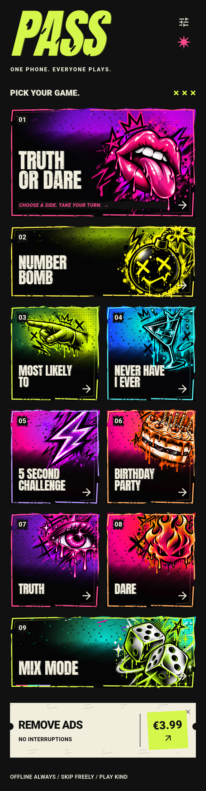
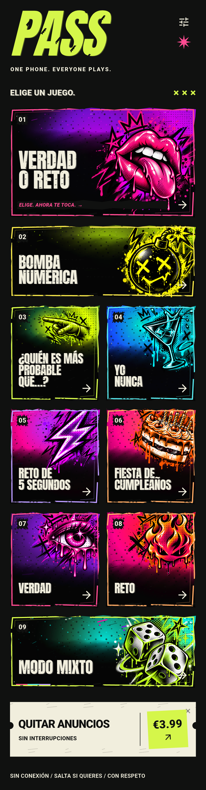

# PASS / Party Games

**INNNX. · 一部手机，大家一起玩 / One phone. Everyone plays. / Un teléfono. Todos juegan.**

## 选择完整介绍 / Choose your language / Elige tu idioma

每种语言都有独立的完整介绍、首页展示和九个玩法入口说明。
Each language has its own detailed introduction, home preview and guide to all nine game entries.
Cada idioma tiene su presentación completa, vista de inicio y explicación de las nueve entradas.

| 中文 | English | Español |
| --- | --- | --- |
| [阅读中文介绍](README.zh.md) | [Read the English introduction](README.en.md) | [Leer la presentación en español](README.es.md) |
|  |  |  |

以上为已有 Android 界面捕获拼接成的完整滚动首页，点击对应语言进入详细介绍。品牌及部分标语保留英语。
These are full scrolling home previews stitched from existing Android UI captures. Open a language page for details. Some branding remains in English.
Son vistas completas del inicio desplazable compuestas a partir de capturas Android existentes. Parte de la marca permanece en inglés.

源码保持私有，目前没有公开试玩包。 / Source code remains private; no playable package is currently public. / El código permanece privado; actualmente no hay un paquete jugable público.

[试玩发布说明 / Playable release guide / Guía de publicación](docs/PLAYABLE-RELEASE.md)
