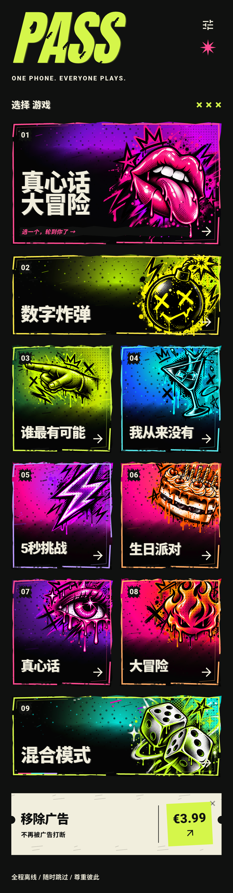

# PASS / Party Games

[中文](README.zh.md) · [English](README.en.md) · [Español](README.es.md) · [项目首页](README.md)

**INNNX. · 一部手机，大家一起玩的聚会小游戏合集**

PASS 把提问、挑战、随机选人和限时回答放进同一款 Flutter 应用。大家围坐在一起，选择一个游戏，按提示互动，再把手机传给下一位玩家。手机负责给出题目、组织轮次和制造悬念，朋友们的回答和反应构成游戏本身。

## 中文 HOME 展示

这是已有 Android 界面捕获拼接成的完整滚动首页，并非单屏截图。游戏入口和操作说明使用中文；PASS 品牌及部分品牌标语保留英语。点击图片查看大图。英语和西语介绍分别展示对应语言的首页。

## 首页设计和导航

深色背景、荧光色、涂鸦插画和编号卡片共同组织首页。嘴唇、炸弹、手指、酒杯、闪电、蛋糕、眼睛和火焰分别对应不同玩法。前两张大卡片突出真心话大冒险与数字炸弹，其余入口便于快速切换游戏。继续向下滚动可看到混合模式和移除广告入口；右上方的按钮进入设置。

## 九个入口的具体玩法

| 入口 | 怎么玩 | 互动重点 |
| --- | --- | --- |
| 01 真心话大冒险 | 添加玩家，转轮盘选出下一位，选择真心话或大冒险，回答问题或完成挑战，再传递手机继续。 | 把提问与行动挑战放在同一轮流程中。 |
| 02 数字炸弹 | 一个隐藏数字是炸弹。轮流选数字，安全选择会缩小可选范围；选中炸弹后出现随机大冒险。 | 范围逐渐缩小带来的紧张感。 |
| 03 谁最有可能 | 读出题目，倒数三、二、一，大家同时指向认为最符合描述的人，再进入下一题。 | 分享彼此印象与选择理由。 |
| 04 我从来没有 | 读出陈述，大家诚实回答“从未”或“有过”，再继续下一条。 | 分享经历、发现共同点。 |
| 05 5 秒挑战 | 读出挑战后启动计时器，在五秒内回答，再把手机交给下一位。 | 快速反应和倒计时压力。 |
| 06 生日派对 | 选择庆祝的主角，按生日主题提示互动，大家一起参与下一项挑战。 | 让庆祝围绕寿星展开。 |
| 07 真心话 | 直接进入只含真心话的玩法，按提示回答并轮流参与。 | 适合想聊天、分享经历的场合。 |
| 08 大冒险 | 直接进入只含大冒险的玩法，以行动挑战为主，按提示完成后继续。 | 用挑战推动聚会气氛。 |
| 09 混合模式 | 选择 Chill 或 Wild，由游戏随机安排挑战，跟随提示并继续传递手机。 | 减少每轮挑选玩法的时间，增加变化。 |

以上依据现有玩法帮助和界面实现整理，不公开具体题库。可以跳过不愿回答或参与的内容，尊重彼此边界。

## 如何开始一场游戏

1. 在首页选择适合当前气氛的模式。
2. 根据模式提示设置玩家或选择生日主角；需要随机选人时使用轮盘。
3. 阅读玩法提示，然后开始提问、挑战或计时。
4. 完成或跳过当前内容，把手机传给下一位，继续新一轮。

## 三种语言、声音与离线体验

应用已有中文、英语和西班牙语界面及本地题库。语言、玩家名单、部分偏好和音频选项由本地组件管理。背景音乐和音效提供操作反馈与游戏节奏，设置中可以调整相关选项。

核心题目内容可以离线使用。广告相关功能需要网络，移除广告入口涉及购买集成。截图中的 €3.99 是该捕获版本的界面显示，不代表已验证的当前商店售价或购买功能已正式上线。

## 实现和当前进度

Flutter、Dart、Flutter 本地化、SharedPreferences、audioplayers；项目还包含 Google Mobile Ads 和 in_app_purchase 集成。已有 Android 调试构建与测试文件。本次整理已有素材和展示文档，没有重新验证发行构建。iOS 工程存在，但本次未确认其运行状态。

目前没有公开试玩包。后续安装包需完成实际设备测试与分发权限核查，再通过 GitHub Releases 发布。自动生成的 Source code 压缩包只是展示文档与图片。

[试玩发布说明](docs/PLAYABLE-RELEASE.md)

## 公开范围

此仓库仅公开作品介绍和界面展示，应用源码保持私有。题库文件、签名材料、开发日志和本机配置不公开。
